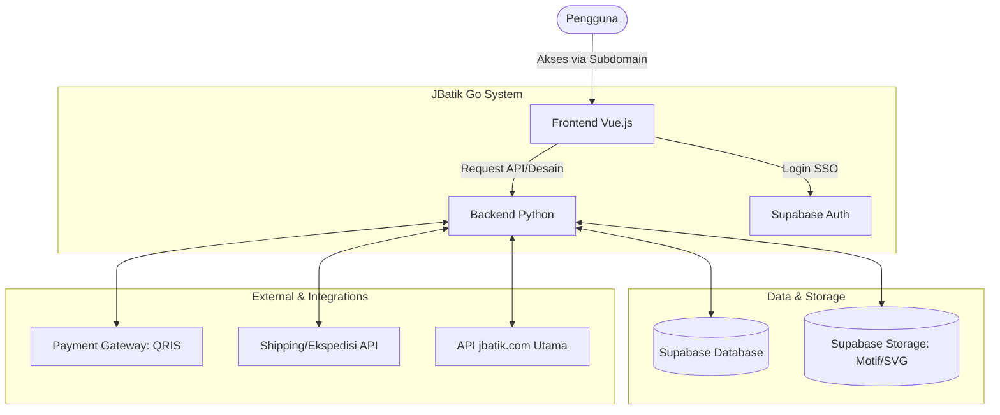
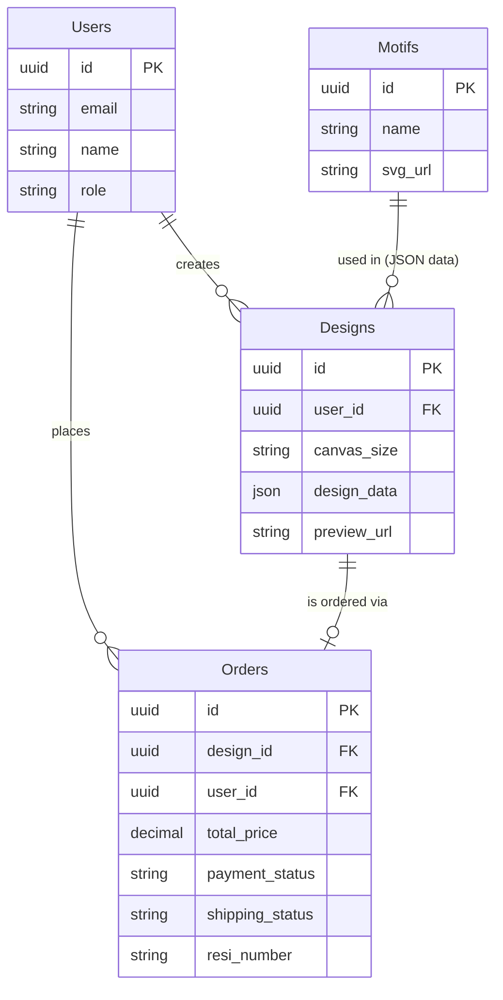

# PRD — Project Requirements Document

## 1. Overview
Banyak orang ingin memiliki pakaian batik dengan desain eksklusif buatan mereka sendiri, namun terhalang oleh minimnya alat desain yang mudah digunakan dan terintegrasi langsung dengan jasa pencetakan kain. 

**JBatik Go** hadir sebagai solusi berbasis web (aplikasi web) yang memungkinkan pengguna awam untuk merancang motif batik pada kanvas kain virtual. Dengan sistem *drag-and-drop* (tarik dan lepas) yang intuitif, pengguna dapat menyusun motif batik yang disediakan, melihat pratinjau desain, dan langsung memesan kain fisik tersebut. Aplikasi ini menjembatani proses kreatif digital hingga produk fisik sampai ke tangan pengguna, sekaligus memperluas ekosistem website utama jbatik.com.

## 2. Requirements
- **Tahap 1 (Fokus Desain):** Pengembangan antarmuka kanvas interaktif di mana pengguna dapat memilih ukuran kain, menentukan *layout* (pola tata letak/grid), dan menarik-lepas (*drag-and-drop*) elemen motif batik dalam format SVG murni.
- **Tahap 2 (Fokus E-Commerce):** Integrasi sistem pendaftaran/masuk pengguna, riwayat desain, pemesanan (checkout), pembayaran terintegrasi, hingga pelacakan pengiriman.
- **Aksesibilitas:** Aplikasi akan diakses melalui subdomain khusus (contoh: `go.jbatik.com`).
- **Autentikasi Mudah:** Harus mendukung kemudahan akses menggunakan akun Google (Google SSO).
- **Sistem Pembayaran:** Diwajibkan mendukung metode pembayaran QRIS yang cepat dan minim gesekan.
- **Integrasi Eksternal:** Aplikasi harus memiliki API yang bisa terhubung dengan *website* utama jbatik, pihak ekspedisi untuk ongkos kirim dan resi, serta *payment gateway*.

## 3. Core Features
- **Smart Design Canvas:** 
  - Ruang kerja digital berbasis perpustakaan motif (format SVG agar tidak pecah saat diperbesar).
  - Sistem *Drag-and-Drop* yang halus ke dalam *grid* atau tata letak kanvas yang dipilih pengguna.
  - Pengaturan ukuran kanvas sesuai kebutuhan kain fisik.
- **Visual Preview:** Fitur untuk melihat hasil akhir desain menyerupai produk asli sebelum melakukan konfirmasi pesanan *(mockup)*.
- **Checkout & Payment:** Proses pemesanan satu pintu yang langsung menghitung harga kain beserta ongkos kirim, dibekali pembayaran QRIS instan.
- **Order Tracking & Notifications:** Sistem pelacakan status pesanan (sedang dicetak, dikirim, dll) beserta notifikasi pengingat ke pengguna.
- **User Dashboard:** Halaman profil tempat pengguna login menggunakan Google SSO untuk melihat daftar desain yang pernah dibuat dan melacak pesanan.
- **Admin Panel:** Halaman khusus bagi admin (pemilik sistem) untuk mengunggah aset motif baru, mengelola pesanan masuk, memperbarui status pengiriman, dan melihat data pengguna.

## 4. User Flow
1. **Akses & Login:** Pengguna mengunjungi aplikasi JBatik Go melalui subdomain khusus dan masuk dengan sekali klik menggunakan akun Google (Google SSO).
2. **Persiapan Kanvas:** Pengguna memilih ukuran kain yang ingin dicetak dan menentukan struktur *layout/grid* pada kanvas.
3. **Proses Desain:** Pengguna memilih galeri motif batik yang tersedia, lalu menarik dan melepaskannya (*drag-and-drop*) ke dalam kanvas. Elemen SVG dapat diputar atau disesuaikan posisinya.
4. **Pratinjau:** Setelah puas, pengguna menekan tombol "Preview" untuk melihat simulasi visual kain batik tersebut.
5. **Checkout & Pembayaran:** Pengguna memasukkan alamat pengiriman, sistem menghitung ongkos kirim secara otomatis berdasarkan ekspedisi, lalu pengguna membayar memindai *barcode* QRIS.
6. **Pelacakan:** Pengguna menerima notifikasi pesanan berhasil, dan dapat memantau status pembuatan hingga pengiriman desain/kain batiknya di halaman *dashboard*.

## 5. Architecture
Sistem menggunakan pendekatan *Microservices-lite* di mana *Frontend* berjalan secara mandiri dan berkomunikasi dengan *Backend* melalui API. Autentikasi dan *Database* dikelola secara rapi menggunakan Supabase.

## 6. Database Schema
Struktur data dirancang untuk menyimpan informasi pengguna, koleksi motif pabrikan, hasil desain *custom* mandiri pengguna, hingga histori transaksi.

### Daftar Tabel Utama:
- **`Users`**: Menyimpan data pelanggan (Login dari Google).
  - `id` (UUID): Identitas unik pengguna.
  - `email` (String): Alamat email (dari Google).
  - `name` (String): Nama lengkap pengguna.
  - `role` (String): Status (Admin / Customer).
- **`Motifs`**: Menyimpan katalog/aset motif batik yang disediakan sistem.
  - `id` (UUID): Identitas unik motif.
  - `name` (String): Nama/jenis motif batik.
  - `svg_url` (String): Tautan lokasi penyimpanan file SVG.
- **`Designs`**: Menyimpan hasil karya/desain masing-masing pengguna.
  - `id` (UUID): Identitas unik desain.
  - `user_id` (UUID): Mengambil dari tabel `Users`.
  - `canvas_size` (String): Ukuran kanvas pilihan.
  - `design_data` (JSON): Menyimpan detail kordinat, tata letak, dan ID motif yang di-*drag-and-drop* di atas kanvas.
  - `preview_url` (String): Gambar pratinjau hasil akhir.
- **`Orders`**: Menyimpan transaksi pemesanan fisik kain.
  - `id` (UUID): Nomor pesanan/transaksi.
  - `design_id` (UUID): Mengambil dari tabel `Designs`.
  - `total_price` (Decimal): Total harga kain + ongkir.
  - `payment_status` (String): Status (Pending, Lunas, Gagal).
  - `shipping_status` (String): Status fisik (Diproses, Dikirim, Selesai).
  - `resi_number` (String): Nomor pelacakan ekspedisi.

## 7. Tech Stack
Berdasarkan preferensi masukan, berikut adalah rekomendasi arsitektur teknologi yang optimal untuk performa *high-end* di web:

- **Frontend:** 
  - **Framework:** Vue.js (Sangat mumpuni untuk membuat *interface* yang reaktif).
  - **Canvas & Drag & Drop Library (Sesuai Permintaan Q7):** Direkomendasikan menggunakan library **Fabric.js** (Sangat handal untuk manipulasi kanvas interaktif berbasis elemen, pelacakan koordinat gambar/SVG, rotasi, *scale*, dan *drag-and-drop*). Alternatif modern khusus Vue adalah **vue-konva**.
  - **Styling:** Tailwind CSS (untuk UI interaktif dan rapi).
- **Backend:** 
  - **Framework:** Python dengan **FastAPI**. (FastAPI sangat cepat, asinkronisasi baik, dan ringan untuk menjembatani antara sistem aplikasi dan API jbatik.com).
- **Database & Authentication:** 
  - **Platform:** Supabase (Menyediakan *database* PostgreSQL *realtime* di latar belakang, *cloud storage* untuk file SVG desain, dan langsung memiliki fitur Google SSO internal).
- **Deployment & Hosting:** 
  - **Infrastruktur:** Vercel (Frontend Vue dan *Serverless Function* untuk backend Python jika dimungkinkan, meski disarankan backend ditaruh di *provider* seperti Render/Railway jika logika pengolahan desainnya berat).
- **Integrasi Pihak Ketiga:**
  - **Ekspedisi/Pengiriman:** API Biteship atau RajaOngkir (Layanan pengecekan ongkir & resi otomatis terpopuler).
  - **Payment Gateway (QRIS):** Midtrans atau Xendit (Sangat mudah integrasi untuk *generate barcode* QRIS).